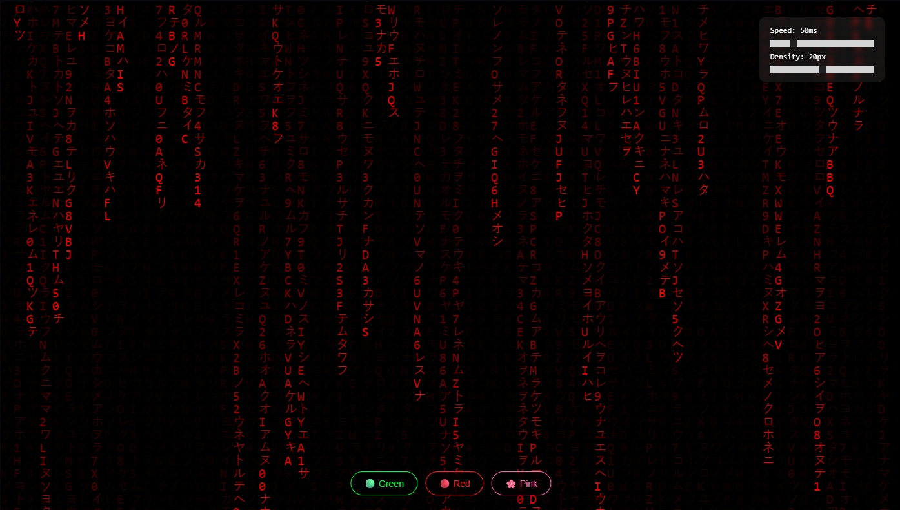

# 🟩 Matrix Rain

> Animated Matrix-style digital rain with 3 color themes — Green, Red, and Pink.

***

## 🎨 Themes

| Theme | Color | Preview |
|-------|-------|---------|
| 🟢 Green (default) | `#00FF41` | Classic Matrix |
| 🔴 Red | `#FF2020` | Blood Rain |
| 🌸 Pink | `#FF69B4` | Cherry Blossom |

***

## ✨ Features

- **HTML5 Canvas** animation — no external libraries
- **3 color themes** switchable in real time
- **Katakana + Latin + Numbers** character set
- Glowing **head character** effect per column
- **Fullscreen mode** (`F` key)
- **Pause / Resume** (`Space` key)
- Fully **responsive** — adapts to any window size
- Works on desktop and mobile

***

## Demo

</img>

***

## 🛠️ Tech Stack

- **Vanilla JavaScript** — no frameworks, no dependencies
- **HTML5 Canvas API** — rendering engine
- **CSS3** — layout and UI controls

***

## 📁 Project Structure

```
matrix-rain/
├── index.html        # Entry point + canvas
├── style.css         # Global styles + controls UI
├── matrix.js         # Core animation engine + themes
└── README.md
```

***

## ⚙️ How It Works

1. The screen is divided into **columns** based on `fontSize` (default: 16px)
2. Each column tracks its own `y` position in a `drops[]` array
3. On every frame, a **random character** is drawn at `(x, y)` for each column
4. A semi-transparent black rectangle is painted over the entire canvas each frame → creates the **fading trail effect**
5. The **head character** (most recent in each column) uses a brighter highlight color
6. When a column reaches the bottom, it randomly resets to the top

***

## 🎮 Controls

| Key / Action | Effect |
|---|---|
| Click 🟢 / 🔴 / 🌸 buttons | Switch color theme |
| `Space` | Pause / Resume animation |
| `F` | Toggle Fullscreen |
| Speed slider | Adjust animation speed |
| Size slider | Adjust character density |

***

## 📦 Running Locally

No build step required. Just open in a browser:

```bash
git clone https://github.com/YOUR_USERNAME/matrix-rain.git
cd matrix-rain
open index.html
# or use Live Server in VS Code
```

***

## 🗺️ Roadmap

| Milestone | Feature |
|---|---|
| `v0.1` | Base animation + 3 themes |
| `v0.2` | Speed/density controls, responsiveness, head glow |
| `v1.0` | GitHub Pages deploy + complete README |
| `v1.1` | Fullscreen + Pause/Resume |
| `v2.0` | Mouse-interactive rain |

***

## 📋 Issues

All features are tracked via using the project board.

***

## 📄 License

MIT — free to use, modify and distribute.

***

<p align="center">Made with 💚 and JavaScript</p>
